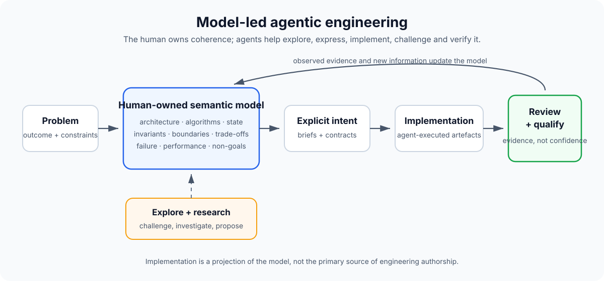

# Model-led agentic engineering

A practical methodology for engineering with AI where the human owns the system model and technical intent, while agents help explore, formalise, implement, challenge and verify it.

> **The implementation can be delegated. The engineering judgement cannot.**

## Core contract

> **Model-led defines what engineering knowledge and authority need to exist. It does not prescribe how tools should execute against them.**
>
> **Humans own intent, judgement and decision authority.**  
> **Agents explore, research, propose, implement, challenge and verify.**  
> **Semantic implementation must not outrun its Decision basis.**  
> **Evidence determines what can actually be claimed.**

This repository starts as a description of how I work. The intention is to make that process explicit enough that other engineers can adopt, test and improve it, then eventually determine whether it can mature into something closer to a repeatable engineering standard.

It is deliberately not a claim that I invented agentic engineering, spec-driven development, or any other existing discipline. It is an attempt to document a working pattern I arrived at independently and now use heavily.

## The short version

I tend to hold a language-independent model of a system in my head before I care about its implementation language.

That model includes things such as:

- what the system is trying to achieve;
- components and responsibilities;
- state and data flow;
- algorithms and calculations;
- interfaces and contracts;
- invariants;
- trust and security boundaries;
- failure behaviour;
- performance and cost constraints;
- what the system must not do.

AI changes how quickly that model can become working software.

Historically, implementation was a serial bottleneck. I could reason through a problem quickly, but turning the solution into code, tests, infrastructure and documentation still took substantial time. With capable agents, much of that translation can be delegated.

That does **not** mean delegating understanding.

The workflow becomes a loop: the engineer maintains the system model, agents help turn that model into implementation and evidence, and what is learnt feeds back into the model.

AI can contribute ideas, research, local reasoning and implementation choices. The human remains responsible for the coherence of the system and for deciding what is accepted.

## Why "model-led"?

The model is the durable understanding of the system, not a particular diagram or document.

It is closer to a modern, continuously evolving UML in your head than to a formal UML artefact. The important part is that it is semantic rather than language-specific.

If the same system were reimplemented in another language, most of the model would survive. The engineer would need to understand the new language's constraints and idioms, but not rediscover what the system is supposed to do.

See [The model](docs/model.md).

## A practice, not an implementation workflow

Model-led agentic engineering does **not** prescribe how a feature must be implemented.

A project can use spec-driven development, an autonomous coding agent, a lightweight intent brief, a conventional ticket, or manual implementation. Those are delivery mechanisms inside the practice.

Model-led governs a different layer: who owns the semantic model, where accepted decisions live, what authority agents have, how implementation is reviewed against human intent, and what evidence is required before accepting the result.

A specification can be useful, but it is only one projection of the model for a particular piece of work.

See [Model-led vs other AI engineering approaches](docs/model-led-vs.md).

## Why "mode-based" as well?

Agents are more useful when they are not treated as one undifferentiated intelligence.

I use different interaction modes for different kinds of work:

- **Explore** — expand the problem space and challenge assumptions.
- **Research** — gather evidence and investigate unfamiliar areas.
- **Specify** — turn accepted decisions into a durable engineering brief.
- **Implement** — translate the agreed model into code and other artefacts.
- **Review** — try to find incorrect assumptions, unsafe behaviour and model drift.
- **Qualify** — gather evidence that the implementation actually satisfies the claims being made.

These modes have different authority. A research agent can discover facts but should not silently make product decisions. An implementation agent can make bounded local choices but should not casually redefine architecture. A reviewer should challenge the work, not quietly change the requirements.

See [Agent modes and authority](docs/modes.md).

## Durable decisions

The human-owned model should not exist only in somebody's head or in old AI conversations.

Projects can keep an append-only `.decisions/` library of authoritative semantic Decisions. Records use YAML front matter so they remain readable by people and queryable by tooling.

Agents may reason about, originate, recommend and draft proposed semantic Decisions. A semantic Decision becomes authoritative only through **human acceptance**.

The acceptance mechanism is implementation-specific. A pull-request merge after human review is one common mechanism, but explicit human acceptance may happen through another workflow or before an agent records the Decision. Git state alone is not proof of authority.

Once accepted, a Decision record becomes immutable and can only be changed through a later superseding Decision.

This also changes review priority: humans can focus more attention on decisions, semantics and accepted risk, while agents perform exhaustive implementation-conformance review. Human code inspection remains available wherever risk or judgement warrants it.

See [Decision library](docs/decision-library.md) and [Decision-first review](docs/decision-review.md).

## Intent and Challenges before decisions

Not all work begins with a Decision.

An **Intent** is a human-owned outcome being pursued. It gives exploration and research direction, but it does not itself create durable semantic authority.

An Intent may end after exploration, proceed under an existing Decision basis, or expose a semantic choice that requires a new human Decision.

See [Intents](docs/intents.md).

Not every problem is already understood well enough to become a Decision.

A **Challenge** records something about the current Decisions, implementation, evidence or observed behaviour that may be wrong, incomplete or worth reconsidering. Challenges may be created by humans or agents because raising a question does not alter the system model.

A Challenge can remain unresolved while evidence is gathered. It may end in no change, an implementation correction under an existing Decision, stronger evidence, or a new human-accepted Decision.

This gives agents a safe way to surface bugs, contradictions and unknowns without silently becoming decision makers.

See [Challenges](docs/challenges.md).

## Why now?

AI has increased implementation throughput much faster than human review throughput.

A process built around humans manually reading every changed line becomes harder to sustain when agents can produce large, coherent changes in minutes. The answer is not to stop reviewing implementation; it is to move scarce human attention towards the semantic decisions that shape it, then use agents and qualification evidence to verify that the implementation conforms.

This pressure is starting to appear in wider tooling discussions too. Cloudflare's October 2026 challenge to build a Git platform for an agent-heavy world explicitly asks developers to rethink repositories, branches, pull requests, worktrees, code review and merge conflicts for large numbers of concurrent agents. That does not validate this methodology, but it is a useful signal that the collaboration primitives around software are becoming part of the problem.

See [Model-led vs other AI engineering approaches](docs/model-led-vs.md#why-this-matters-now).

## What this is not

This is not:

- "vibe coding";
- prompting until something appears to work;
- treating generated code as a black box;
- assuming AI output is correct because it compiles;
- measuring engineering ability by how many lines a human personally typed;
- replacing engineering judgement with model confidence;
- a requirement to use one specific model, IDE, harness or agent framework.

The goal is to increase the amount of **correct engineering intent that can become shipped software**, without reducing understanding or accountability.

## Handbook

Start here:

1. [Core principles](docs/principles.md)
2. [The human-owned system model](docs/model.md)
3. [Authorship, ownership and understanding](docs/authorship-and-ownership.md)
4. [Agent modes and authority](docs/modes.md)
5. [The working loop](docs/workflow.md)
6. [Decision library](docs/decision-library.md)
7. [Intents](docs/intents.md)
8. [Challenges](docs/challenges.md)
9. [Decision-first review](docs/decision-review.md)
10. [Model-led vs other AI engineering approaches](docs/model-led-vs.md)
11. [Externalising intent](docs/externalising-intent.md)
12. [Verification and evidence](docs/verification.md)
13. [Measuring effectiveness](docs/measurement.md)
14. [Anti-patterns](docs/anti-patterns.md)
15. [Abstract examples](docs/examples.md)
16. [Maturity model](docs/maturity.md)
17. [Adopting Model-led in a repository](docs/adoption.md)

Practical templates:

- [Engineering intent brief](templates/intent-brief.md)
- [Decision record](templates/decision-record.md)
- [Challenge](templates/challenge.md)
- [Adversarial review brief](templates/adversarial-review.md)
- [Qualification plan](templates/qualification-plan.md)
- [Session measurement](templates/session-measurement.md)

Experimental measurement work lives in [experiments/](experiments/).

## Set up Model-led in another repository

A capable repository agent can bootstrap the portable Model-led conventions into a new or existing repository.

A user can give the agent this repository and ask:

> **Set up Model-led in this repository using https://github.com/jralph/model-led-agentic-engineering**

The source [AGENTS.md](AGENTS.md) contains bootstrap instructions. The minimum setup is intentionally small: a canonical `.decisions/` library plus Model-led authority guidance merged into the target repository's existing `AGENTS.md`.

For an existing repository, the explicit adoption request will normally be the first recorded Decision: adopt Model-led as the repository's engineering governance method. The human request itself supplies the semantic acceptance; the repository's normal review/publication workflow still applies. For a new project created as Model-led from inception, no adoption Decision is necessary.

See [Adopting Model-led](docs/adoption.md).

## Future applications

The methodology does not require new source-control tooling, but it suggests some collaboration primitives that may be better suited to agent-heavy engineering.

One exploratory direction is a **decision-native Git platform** that implements Model-led in a more opinionated way. **Project** becomes the human collaboration unit above a Model Repository and one or more ordinary Git Implementation Repositories, providing semantic-monorepo coherence without forcing a physical monorepo. The platform introduces **Task** as its work-item container for Intent- or Challenge-driven potential work, while a traditional Pull Request becomes a Project-level **Decision Review** spanning whichever implementation repositories are required. Task is a platform choice, not a Model-led methodology primitive.

See [Potential future Git platform](docs/future-git-platform.md).

## Current status

**v0.1: personal working methodology.**

At this stage the repository describes a method that works for me. It is not yet a standard and the maturity model is intentionally provisional.

The next stage is to make the method measurable: capture real agentic engineering sessions, identify where intent is lost between modes, quantify semantic rework, and test whether the approach remains effective across different engineers and codebases.

See [ROADMAP.md](ROADMAP.md).

## A useful test

The simplest test of whether the human still owns the engineering is:

> If the generated implementation disappeared and I had to explain the system to another capable engineer, could I explain what it does, why it behaves that way, its important constraints, and how I would recreate it?

If the answer is no, the agent probably owns too much of the model.

If the answer is yes, the fact that an agent produced the syntax is much less important.
