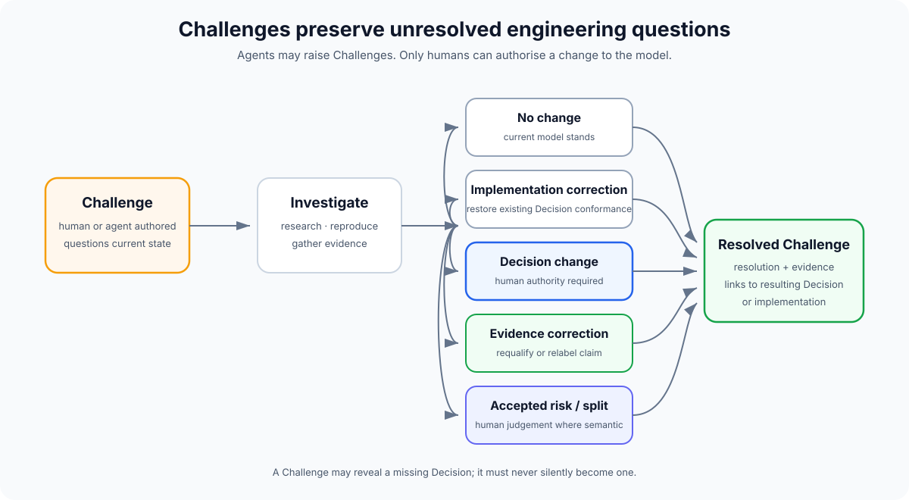

# Challenges

A **Challenge** is the semantic concept of questioning something about the current system model, implementation or evidence that may be wrong, incomplete, unsafe, stale or worth reconsidering.

It is not defined by a particular file, folder or storage format. A platform may represent a Challenge as an issue-like object, a database record, Markdown or something else.

A Challenge does **not** change the model.

That distinction is what makes it safe for both humans and agents to create Challenges.

> **Decision:** this is what humans have accepted as authoritative.  
> **Challenge:** this is something that deserves investigation before we know whether the model should change.

Challenges provide a durable place for unresolved engineering knowledge without forcing every observation into a solution or a new Decision.



## Why Challenges exist

Traditional Issues often mix several different things:

- a bug;
- a proposed solution;
- a feature request;
- an investigation;
- a task somebody should implement;
- a concern that may turn out to be wrong.

That can encourage solution-first behaviour.

A Challenge starts one step earlier:

> **What about the current state deserves to be questioned?**

It can exist before anyone knows the answer.

That makes Challenges useful for agentic engineering because agents can safely surface discoveries without acquiring authority to change the system model.

## What can be challenged?

### A Decision

An accepted Decision may no longer be appropriate.

Example:

> The current retention Decision assumes indefinite storage, but a new requirement appears to require deletion after 30 days.

The Challenge questions the Decision. The Decision remains authoritative until a human accepts a superseding Decision.

### A missing Decision

The current model may not contain any Decision governing behaviour that now needs an explicit human choice.

Example:

> Retry behaviour exists in code, but there is no active Decision defining whether duplicate delivery is acceptable.

The Challenge questions the **absence of authority**, not an existing Decision. It can remain open while the behaviour is investigated. If a semantic choice is required, a human-authored Decision fills the gap.

### Implementation

The code may not conform to an active Decision.

Example:

> DEC-142 requires server-side authorisation, but this route appears to trust a client-side check.

This may be resolved as an implementation correction with no new Decision.

### Evidence

The evidence supporting a claim may be weak, stale or incorrectly labelled.

Example:

> The current latency evidence is from a local production seam but is being used as deployed-path evidence.

The implementation may be correct. The qualification needs to be corrected.

### Observed behaviour

Production or user behaviour may expose something the current model does not explain.

Example:

> Requests are occasionally processed twice under retry, but no active Decision describes duplicate-delivery semantics.

This may reveal a missing Decision.

### An opportunity

New information may make an existing design worth revisiting.

Example:

> A newly available platform capability may let us remove a bespoke subsystem.

A Challenge can document the opportunity without prematurely deciding to adopt it.

### An unknown

Sometimes the useful artefact is simply a well-formed uncertainty.

Example:

> We do not know whether this invariant still holds when three regions fail over concurrently.

That is better preserved as a Challenge than silently forgotten.

## Challenges can be human- or agent-authored

Unlike accepted Decisions, a Challenge does not require human authorship.

Agents **may create Challenges autonomously**.

This is intentional.

Raising a Challenge says:

> I found something that may need judgement.

It does not say:

> I have changed what the system is allowed to believe.

This gives research, review and qualification agents a safe output when they discover:

- conflicting assumptions;
- missing evidence;
- likely bugs;
- unmodelled failure states;
- opportunities;
- possible Decision violations.

Agents should prefer raising a Challenge over silently inventing a Decision.

## Challenges should not require a solution

A Challenge can be useful even when nobody knows how to resolve it yet.

A good Challenge records:

- what was observed;
- what may be wrong or incomplete;
- which Decisions or semantic areas may be affected, including whether a Decision appears to be missing;
- available evidence;
- uncertainty;
- why it matters.

A proposed solution is optional.

This is important because a premature solution can narrow investigation before the actual problem is understood.

## Decision basis and implementation

Every meaningful semantic implementation change should have a **Decision basis**.

A Challenge itself does not always have one.

That is because one purpose of a Challenge is to discover that the current model is missing a Decision.

When a Challenge is resolved:

### Existing Decision already governs the behaviour

Fix the implementation and tie the change to that Decision.

No new Decision is necessary.

### The model needs to change

A human proposes a new or superseding Decision, normally through a Decision Review.

Implementation then proceeds against the changed Decision basis.

### No Decision exists for a semantic behaviour that must be chosen

Stop before silently establishing that behaviour in code.

A human Decision is required.

This preserves the core authority boundary:

> **Agents may discover that a Decision is needed. They may not fill the gap by silently making one.**

## Challenge lifecycle

A Challenge begins unresolved.

Investigation can end in several ways.

### No change

The Challenge was investigated and the current model remains correct.

Record enough resolution context that the same question does not need to be rediscovered immediately.

### Implementation correction

The active Decisions were correct but implementation did not conform.

Fix the implementation against the existing Decision basis.

### Decision change

The Challenge demonstrates that the model itself needs to change.

A human creates or accepts a new Decision, potentially superseding an earlier one.

### Evidence correction

The claim may still be correct, but its evidence was insufficient, stale or incorrectly classified.

Qualification is rerun or corrected.

### Accepted risk

The Challenge is valid, but humans explicitly choose not to change the system now.

If that accepted risk is durable or materially constrains future engineering, the acceptance itself should normally become a Decision.

### Split or duplicate

The Challenge is actually several independent questions or is already covered elsewhere.

## Mutable by design

Challenges are not immutable Decision history.

They need to accumulate:

- investigation notes;
- evidence;
- links;
- narrowed scope;
- resolution;
- relationships to resulting Decisions or implementation.

Their history should still be preserved by the underlying system, but the current Challenge object can evolve while the question is being worked.

This is another reason Challenges and Decisions should remain separate primitives.

## Representation is implementation-specific

Challenge is a methodology concept, not a required repository document type.

The methodology does not require a `.challenges/` directory or any other storage convention.

A Challenge may live in:

- an existing issue tracker;
- Markdown;
- a dedicated challenge store;
- a future decision-native Git platform.

What matters is the semantic contract.

A lightweight record can use:

```yaml
id: CH-20261005-203000-retry-idempotency
title: Retry path may violate idempotency Decision
type: implementation
created_at: 2026-10-05T20:30:00+01:00
created_by: agent:adversarial-review
targets:
  decisions:
    - DEC-20260920-101500-idempotency
  areas:
    - payments
status: open
```

The metadata is intentionally illustrative rather than a required schema at this stage.

## Suggested Challenge types

Start small:

- `decision` — questions an accepted Decision or the absence of a Decision that appears necessary;
- `implementation` — questions conformance of code or infrastructure;
- `evidence` — questions qualification or a claim;
- `behaviour` — records observed behaviour not adequately explained;
- `opportunity` — suggests something may be worth reconsidering;
- `unknown` — preserves an unresolved engineering uncertainty.

Types describe what is being challenged, not severity.

## Challenges and agent modes

Challenges are useful outputs from several modes.

### Explore

May surface Challenges against assumptions or problem framing.

### Research

May create Challenges when evidence contradicts the current model.

### Implement

Should create or escalate a Challenge when implementation exposes an ambiguity that cannot be resolved within local authority.

### Review

Can create Challenges for likely Decision violations, model drift or unsafe behaviour.

### Qualify

Can create Challenges when evidence is missing, stale, contradictory or weaker than the claim.

A Challenge is therefore a natural hand-off from machine discovery to human judgement.

## Challenges and Decision Reviews

A Decision Review can be opened because of one or more Challenges.

The review should show which Challenges it intends to resolve.

A Challenge does not have to result in a Decision Review.

For example:

- a straightforward implementation bug may be fixed under an existing Decision;
- weak evidence may only need requalification;
- an incorrect Challenge may close with no change.

Where the model changes, the Decision Review becomes the human acceptance boundary.

## Bugs fit naturally

A bug is often one of two things:

### Implementation violates an existing Decision

The Challenge documents the observed failure.

The fix restores conformance.

### Expected behaviour was never decided

The bug report exposes a gap in the model.

The human must decide what behaviour is correct before or alongside implementation.

This is more precise than assuming every bug report already contains the right solution.

## Challenges and planning

Challenges are not automatically backlog tasks.

A project can have valid Challenges that are:

- being investigated;
- waiting for evidence;
- explicitly deferred;
- accepted risks;
- not currently worth solving.

Planning should distinguish:

> **This question exists**

from:

> **We have decided to spend engineering capacity changing the system because of it.**

That distinction becomes more useful as agents make implementation cheaper than human attention.
