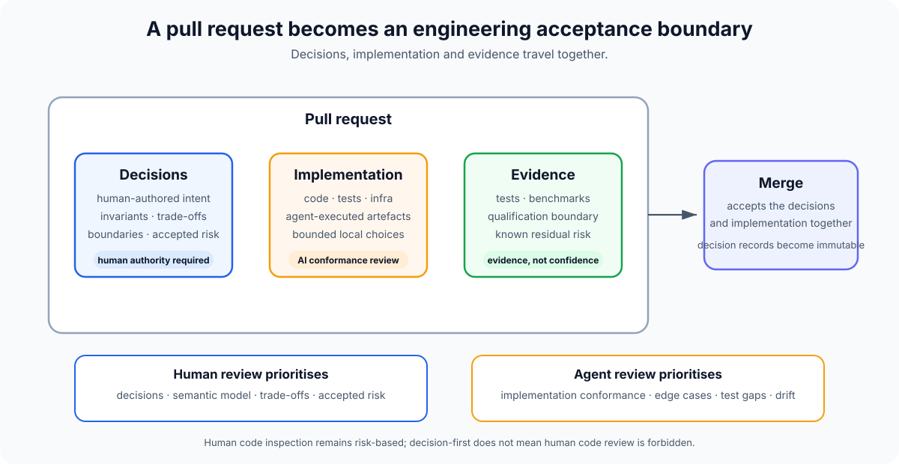

# Decision-first review

Agent-generated implementation changes the economics of review.

Producing and mechanically inspecting code can be delegated increasingly well. Human judgement remains scarce.

Model-led agentic engineering therefore treats the **review/acceptance surface** as more than a code diff.

A pull request is one common implementation, but the methodology does not require Git or pull requests.

A substantial review can contain:

- **Intent** — the human-owned outcome being pursued;
- **Decisions** — accepted authority plus any semantic Decisions currently proposed for human acceptance;
- **Challenges** — unresolved questions the change is intended to resolve;
- **implementation** — how those decisions are expressed;
- **evidence** — what has been demonstrated about the result.



## Intent entering review

The review should make the active Intent clear enough that humans can judge whether the proposed Decisions and implementation actually pursue the right outcome.

Intent is mutable during exploration and review. Changing it may invalidate proposed Decisions, implementation or evidence and should trigger re-evaluation where necessary.

Intent does not itself create authority for semantic implementation. The review still needs a sufficient Decision basis.

## Challenges entering review

A Decision Review may be opened because one or more Challenges show that the current model or implementation needs attention.

A review does not require a new Decision. It may exist purely to accept implementation that restores or realises an existing Decision basis.

The review should make clear whether each Challenge is expected to resolve through:

- no model change;
- an implementation correction under existing Decisions;
- a new or superseding Decision;
- stronger or corrected evidence;
- explicitly accepted risk.

A Challenge is therefore an input to review, not itself a Decision.

## Human review priority

Human reviewers should spend their highest-value attention on:

### The decision

- Is this the right problem to solve?
- Is the chosen trade-off acceptable?
- Is the invariant actually desirable?
- Is the abstraction boundary right?
- Are we creating a precedent we want other work to follow?

### The semantic model

- Does this fit the rest of the system?
- Does it conflict with another accepted decision?
- Are responsibilities and ownership in the right place?
- What new states or failure modes become possible?

### Accepted risk

- Is the evidence strong enough for the change being made?
- Which gaps remain?
- Are those gaps acceptable now?
- What would require revisiting the decision?

The human is not prohibited from reviewing code. Code inspection remains appropriate anywhere direct judgement is valuable.

## Agent review priority

Agents are well suited to exhaustive conformance work:

- compare the implementation with proposed decisions;
- load relevant active decisions from `.decisions/`;
- identify violations or ambiguity;
- inspect changed paths for bugs and edge cases;
- assess tests against stated behaviours;
- check for unintended scope expansion;
- verify repository conventions;
- challenge security and failure handling;
- report claims that are stronger than the evidence.

A reviewer should not silently change the implementation to make its own preferred decision true.

If code cannot conform without changing the semantic model, an agent may propose a semantic Decision, but human acceptance is required before that Decision becomes authoritative.

## Review is a feedback loop

Decision-first review is not a one-way approval gate.

Proposed Decisions are still mutable until human acceptance. A reviewer may decide that the proposed behaviour, threshold, boundary or trade-off is wrong even when the implementation matches it perfectly.

When a human changes a proposed Decision before acceptance:

1. the updated proposal becomes the candidate semantic direction;
2. agents re-evaluate the implementation against it;
3. implementation changes where conformance now differs;
4. review runs again against all relevant active and proposed decisions;
5. qualification is rerun where the changed decision alters the claim being accepted.

This is one of the main benefits of making Decisions explicit. The reviewer changes the **proposed semantic direction**, not individual implementation details, and agents can propagate that change through the codebase before acceptance.

This allows a human to say, for example, "the threshold should be 750 ms rather than 500 ms" or "this path must remain read-only", then have the implementation and evidence re-evaluated against that change rather than manually directing every affected line.

## A possible review surface

A tool could eventually present a change approximately like this:

```text
Decisions proposed
  DEC-104  Speculative execution requires accepted confidence
  DEC-105  Authoritative resolution remains the fallback
  DEC-106  Presentation work cannot delay action execution

Relevant active decisions
  11 loaded for changed areas
  0 supersession conflicts

Implementation conformance
  10 verified
  1 material review finding
  0 unresolved invariant violations

Qualification
  E1 deterministic behaviour        pass
  E3 production-seam behaviour      pass
  E4 live dependency                pass
  E6 installed end-to-end path      not supplied

Human review
  [ ] accept proposed decisions
  [ ] accept trade-offs
  [ ] accept residual evidence gap
```

This is not a required format. It illustrates where review attention can move.

## Human acceptance makes a Decision authoritative

Decision-first review is one mechanism for obtaining human acceptance, not the semantic definition of acceptance itself.

A project may use pull requests, a dedicated review system, direct human instruction or another explicit workflow.

The important invariant is:

> **A proposed semantic Decision is not authoritative until a human accepts it.**

Where pull requests are used as the acceptance mechanism, merging a reviewed Decision change can make that acceptance durable.

Where a human explicitly makes the Decision before an agent records it, a second ceremonial approval is not required unless repository policy requires one.

After human acceptance:

- the Decision becomes immutable;
- implementation is expected to conform to it;
- future agents can retrieve it as authoritative context;
- changing its authority requires another human-accepted superseding Decision.

A project should make changes to `.decisions/**` conspicuous and ensure its chosen acceptance mechanism cannot be satisfied solely by the agent proposing the Decision.

Recommended team controls can include:

- CODEOWNERS for `.decisions/**`;
- required human approval;
- prevention of bot-only approval for Decision changes;
- append-only validation.

The exact mechanism varies by workflow and platform.

## Human code review remains risk-based

"AI reviews code, humans review decisions" is a useful direction, but too absolute as a rule.

Direct human code inspection remains valuable for areas such as:

- novel concurrency;
- cryptography;
- security boundaries;
- irreversible data migrations;
- performance-critical algorithms;
- unfamiliar runtime behaviour;
- weak qualification evidence;
- anything where the reviewer wants direct confidence.

The shift is one of **review priority**, not a ban on human code review.

## Why this matters

A pull request containing thousands of agent-generated lines may represent only a few meaningful engineering decisions.

Reviewing those decisions carefully, then using agents and evidence to check the implementation against them, can make human review both more scalable and more relevant.

The question changes from:

> Did the agent write every line correctly?

towards:

> Are these the right decisions, and do the implementation and evidence faithfully realise them?
