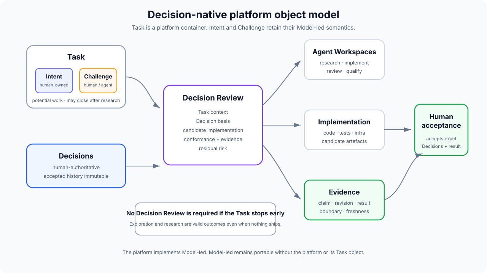
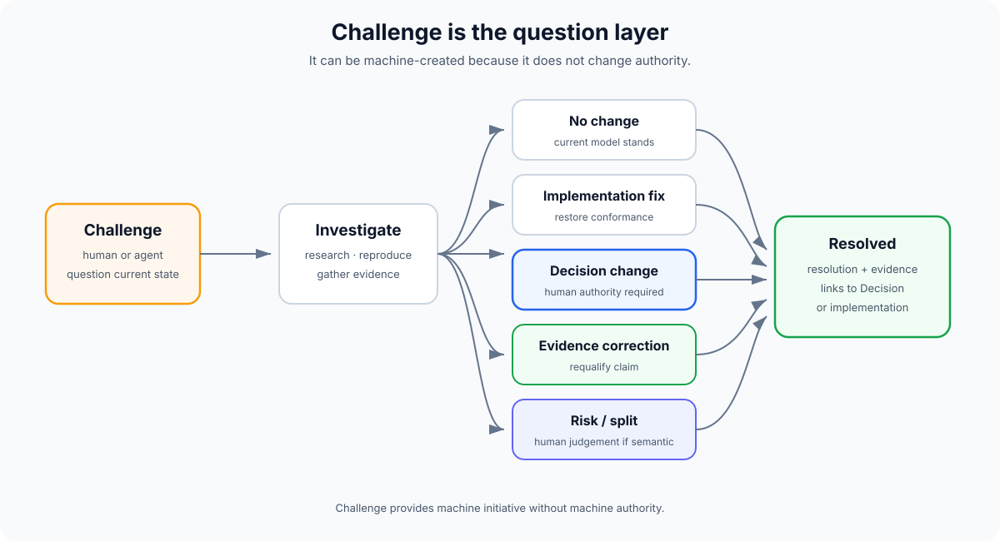

# Potential Git platform: semantic primitives

> **Status:** exploratory implementation concept.  
> This describes one possible platform built **using** model-led agentic engineering. It is not part of the methodology itself.

A decision-native Git platform should not begin by asking how to add AI to repositories, branches, issues and pull requests.

It should ask which collaboration objects still matter when implementation is cheap and human judgement is scarce.

The proposed answer is to make **intent and decisions primary**, and move source files, branches and diffs into the implementation layer underneath them.

## Core objects

The platform revolves around six primary platform objects:

1. **Project** — the human-facing semantic unit above one Model Repository and one or more Implementation Repositories.
2. **Task** — the platform work item for potential work driven primarily by a Model-led Intent or Challenge.
3. **Decision** — durable human-authoritative judgement.
4. **Decision Review** — the Project-level acceptance boundary for Decisions, implementation, evidence and residual risk.
5. **Evidence** — what has actually been demonstrated about an implementation.
6. **Agent Workspace** — an isolated execution context operating within explicit authority across whichever repositories a Task requires.

**Intent** and **Challenge** remain first-class Model-led semantic concepts. The platform represents them through Task rather than redefining them as platform-only concepts.

Source code remains critical, but becomes an **implementation artefact** attached to this semantic model rather than the primary collaboration object.

The detailed [Project and repository model](future-git-platform-project-repositories.md) treats a Project as a semantic monorepo over one or more physical Git repositories.



## Task

Task is deliberately a platform primitive rather than a Model-led one.

The platform needs a work item that can be listed, assigned, filtered and progressed. Its primary driver is either:

- an Intent;
- a Challenge.

A Task follows the Model-led loop and may close after exploration/research without creating a Decision or implementation.

See [Task model](future-git-platform-tasks.md).

## Intent

Intent is the mutable human-owned objective behind a piece of work.

Examples:

> Reduce cold-start latency without increasing incorrect execution.

> Allow third-party extensions without granting arbitrary host access.

> Remove the current account-provisioning bottleneck without weakening isolation.

Intent answers:

> **What are we trying to achieve?**

A Decision answers:

> **What have we decided must be true while achieving it?**

Intent can evolve during exploration and review. In this platform it normally lives as the human-owned direction of an Intent-driven Task, or as an Intent attached to work that originated from a Challenge. It becomes provenance rather than an immutable repository invariant.

## Decision

Decisions are the durable, human-authoritative layer.

A Decision may define:

- an invariant;
- architecture;
- behaviour;
- an interface;
- security;
- operational constraints;
- product boundaries;
- process.

An agent may reason about, originate, recommend and draft a proposed semantic Decision. Human acceptance is what authorises it.

The platform should understand the repository's `.decisions/` history as a native object model rather than treating it as ordinary Markdown.

## Decision basis

Every meaningful semantic implementation change should have a **Decision basis**.

The authoritative Decision basis is the set of **accepted Decisions** that governs the change.

A Decision Review may also contain proposed Decisions under evaluation. Those proposals can guide candidate implementation, conformance analysis and qualification, but they do not join the authoritative Decision basis until human acceptance.

This means work may be:

- implementation/restoration entirely under existing accepted Decisions;
- candidate implementation under existing Decisions plus one or more proposed Decisions;
- implementation after newly proposed Decisions receive human acceptance.

This avoids decision inflation.

A bug fix does not need a new Decision when the correct behaviour is already defined.

Example:

> DEC-142 says authorisation must be checked server-side.  
> A route incorrectly trusts a UI check.  
> The fix cites DEC-142 and introduces no new Decision.

The platform can make **unbound semantic implementation** conspicuous:

> This change alters semantic behaviour but has no governing accepted Decision basis.

That may mean the correct Decision already exists but has not been linked, or that new semantic authority is genuinely missing. An agent may propose the missing Decision, but cannot make it authoritative without human acceptance.

## Ruleset snapshots

The platform can support reusable organisational or ecosystem Rulesets without making Project authority remotely mutable.

An upstream Ruleset catalogue can expose:

- security baselines;
- reliability standards;
- data-governance Rules;
- product-family constraints;
- other reusable normative guidance.

When a Project adopts one, the platform materialises an exact local snapshot into the Project model and records the Project Decision that adopts it.

The platform must preserve both old and new local snapshots across upgrades.

For example:

```text
company-security
  abc123   adopted by DEC-41
  xyz789   adopted later by DEC-88
```

The newer snapshot does not mutate `abc123`. DEC-88 may supersede DEC-41, while both snapshots remain available for historical reconstruction.

The upstream catalogue is distribution infrastructure, not Project authority.

## Challenge

Challenge is one Model-led semantic form that a platform Task can carry.

The **Task** replaces much of today's Issue model. Traditional Issues often collapse observation, desired outcome, solution and work assignment into one object.

A Challenge instead means:

> **Something about the current model, implementation or evidence deserves to be questioned.**

Challenges may target:

### A Decision

> DEC-89 assumes indefinite retention, but a new requirement appears to require deletion after 30 days.

### A missing Decision

> Retry behaviour exists in implementation, but no human Decision defines duplicate-delivery semantics.

This questions an absence of authority rather than an existing Decision.

### Implementation

> The retry path appears not to satisfy the idempotency Decision.

### Evidence

> The current evidence is being described as deployed behaviour but was collected only locally.

### Observed behaviour

> Users are seeing a state the current model does not explain.

### An opportunity

> A newly available platform capability may make the current bespoke component unnecessary.

### An unknown

> We do not know whether the invariant still holds during simultaneous regional failure.

## Agents may raise Challenges

Agents should be allowed to create Challenges autonomously.

That is safe because a Challenge changes no authority.

It says:

> I found something that may require human judgement.

It does not say:

> I have decided how the system should change.

This gives research, review and qualification agents a safe output for:

- likely bugs;
- conflicting assumptions;
- missing evidence;
- security concerns;
- performance regressions;
- opportunities;
- semantic ambiguity.

## Challenge lifecycle

A Challenge can resolve as:

### No change

Investigation shows the existing model is still appropriate.

### Implementation correction

The active Decision is correct and the code is not.

### Decision change

An agent or human may propose a new or superseding Decision; a human must accept it before it becomes authoritative.

### Evidence correction

The claim needs better or correctly classified qualification.

### Accepted risk

The concern is valid but humans explicitly choose not to change the system now.

### Split or duplicate

The Challenge represents multiple independent questions or already exists elsewhere.



## Decision Review

A **Decision Review** is the main change/review object.

It replaces the assumption that the primary object under review is a diff.

A Decision Review contains:

### Origin

The Task, Intent and/or Challenge that explains why the work exists.

### Decision basis

The accepted Decisions governing the semantic implementation.

### Proposed Decisions

Any additional semantic Decisions under evaluation. These remain non-authoritative until human acceptance.

### Challenges

Which unresolved questions caused or are expected to be resolved by the work.

### Implementation

One or more candidate implementations.

### Conformance

Whether each implementation satisfies applicable Decisions.

### Evidence

What qualification supports acceptance.

### Residual risk

What remains uncertain or deliberately accepted.

A Decision Review can contain **zero proposed/new Decisions**.

That is normal when existing accepted Decisions already provide a sufficient basis, including implementation corrections, refactors or improvements that preserve established semantics.

## Evidence

Evidence should be first-class rather than reduced to a green CI badge.

An evidence receipt could record:

- claim;
- evidence class;
- exact implementation revision;
- Decision-set digest;
- environment;
- observed result;
- collection time;
- raw artefacts;
- known limitations;
- freshness or expiry where appropriate.

An evidence receipt is immutable evidence of what was observed at that point in time.

Its **applicability** may later become stale when:

- implementation changes;
- a governing Decision changes;
- a dependency changes;
- environment changes;
- the agreed freshness period expires.

The UI should distinguish:

> this passed once

from:

> this remains applicable evidence for the implementation and Decision set currently under review.

## Agent Workspace

An Agent Workspace is an isolated execution context associated with a Task or Decision Review.

It belongs to the Project and may span several Implementation Repositories. The platform may host it itself or an external harness may create and attach its result.

It can contain:

- role/mode;
- baseline revision;
- active/proposed Decision context;
- explicit authority;
- branch, fork or worktree;
- allowed tools and credentials;
- current status;
- evidence produced;
- resource/cost metadata where useful.

Possible workspace roles:

- research;
- implementation;
- alternative implementation;
- adversarial review;
- qualification;
- semantic conflict analysis.

A workspace is disposable.

The semantic artefacts it contributes may not be.

## Implementation

Implementation includes:

- source code;
- tests;
- infrastructure;
- migrations;
- schemas;
- configuration;
- generated artefacts;
- documentation describing current implementation.

Traditional files and diffs remain available.

The difference is hierarchy.

Implementation is presented in relation to:

> **Which Decisions does this express, which Challenges does it resolve, and what evidence supports it?**

## Areas

Folder structures are useful to compilers, tooling and implementation specialists.

They are not necessarily the best primary map for a human decision maker.

A platform can introduce **Areas** as semantic groupings such as:

- authentication;
- billing;
- resolution;
- observability;
- data retention;
- release infrastructure.

An Area can surface:

- active Decisions;
- open Challenges;
- open Decision Reviews;
- ownership;
- evidence health;
- agent activity;
- implementation surfaces;
- related external systems.

Paths remain useful as implementation metadata, but humans need not navigate file trees to understand the model.

## Semantic conflicts

Traditional Git detects textual conflicts.

An agent-heavy platform needs other conflict types.

### Text conflict

The underlying source cannot be merged automatically.

### Decision conflict

Two Decisions cannot both be satisfied.

### Intent conflict

Two pieces of work pursue outcomes that require an unresolved human trade-off.

### Conformance conflict

Implementation contradicts a governing Decision.

### Evidence conflict

The evidence supports incompatible claims or no longer applies to the current implementation/Decision set.

### Authority conflict

An agent attempts to make a semantic change outside its allowed authority.

Different conflict types need different resolution paths. Treating them all as merge conflicts loses useful meaning.

## Provenance graph

The platform can maintain a semantic graph:

```text
Challenge
    -> Intent
    -> Proposed Decision
    -> Decision Review
    -> Agent Workspace
    -> Implementation revision
    -> Evidence
    -> Merge
    -> Accepted Decision

Accepted Decision
    -> later Challenge
    -> superseding Decision
```

This graph should answer:

- Why does this behaviour exist?
- Which review accepted it?
- What implementation introduced it?
- What evidence supported it?
- Which Challenges have questioned it?
- What would be affected if it changed?

## Default authority

A possible platform default:

| Object/action | Human | Agent |
| --- | --- | --- |
| Create Challenge | Yes | Yes |
| Investigate Challenge | Yes | Yes |
| Define/change Intent | Yes | Draft/recommend |
| Draft/originate proposed Decision | Yes | Yes |
| Confer semantic authority / accept Decision | Yes | No |
| Implement against Decision basis | Yes | Yes |
| Produce Evidence | Yes | Yes |
| Review conformance | Yes | Yes |
| Accept residual semantic risk | Yes | No |
| Merge accepted Decision Review | Yes/policy | No by default |

Repository policy may automate more execution, but an agent cannot satisfy the human-acceptance requirement for its own semantic Decision proposal.

## Portability

The platform should not make Model-led dependent on itself.

The minimum portable state remains ordinary repository data:

- code;
- tests;
- `.decisions/`;
- Git history;
- optional agent/context files.

Challenges, workspaces and rich review metadata may live in platform storage initially, but meaningful export should be possible.

> **The platform implements Model-led. Model-led does not require the platform.**
