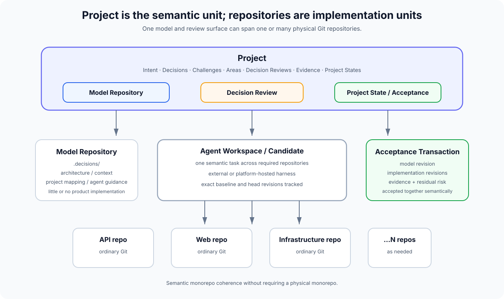

# Potential Git platform: Project and repository model

> **Status:** exploratory implementation concept.  
> This describes one possible platform built using Model-led agentic engineering. It is not part of the methodology itself.

Traditional Git platforms usually make the **repository** the primary unit of collaboration.

That made sense when humans mostly worked directly in source trees, branches and pull requests.

An agent-first platform can invert that hierarchy:

> **The Project is the human collaboration unit. Repositories are implementation and storage units underneath it.**

This creates something close to a **semantic monorepo over a physical polyrepo**.

Humans see one coherent product/system model even when its implementation is split across several independent Git repositories.



## Project

A Project represents one coherent software system or product from the human decision-making perspective.

A Project owns or links:

- one **Model Repository**;
- one or more **Implementation Repositories**;
- semantic Areas;
- platform **Tasks** driven by Intent or Challenge;
- Decision Reviews;
- Evidence;
- Agent Workspaces;
- releases and accepted Project states.

A minimal Project therefore has:

```text
Project
  Model Repository
  Implementation Repository
```

A larger Project may have:

```text
Project
  Model Repository

  Implementation Repositories
    desktop-client
    API
    infrastructure
    website
    shared-SDK
```

The number of physical repositories should not determine how fragmented the human experience becomes.

## Model Repository

The Model Repository is the portable Git-backed source for durable human semantic authority.

It may contain:

```text
.decisions/
architecture/
context/
AGENTS.md
project.yaml
```

The exact structure is exploratory except for the existing Model-led `.decisions/` semantics.

The Model Repository should contain little or no product implementation code.

Its purpose is to preserve and distribute the model that implementation agents need:

- accepted Decisions;
- architecture/context where useful;
- project-level agent guidance;
- mappings between semantic Areas and implementation repositories;
- portable metadata needed to reconstruct the Project outside the platform.

A platform UI can make these objects first-class without requiring humans to navigate the underlying directory structure.

## Decision Repository vs Model Repository

The narrowest version could be called a **Decision Repository** because immutable Decisions are the most important portable authority.

The broader term **Model Repository** is useful if the repository also carries:

- current architecture/context;
- project-level agent guidance;
- repository mappings;
- model-level schemas.

The platform should keep these semantics distinct:

- Decisions are accepted human authority and immutable after acceptance;
- architecture/context describes current understanding and may evolve;
- agent guidance describes how agents should operate now and may evolve.

The Model Repository is therefore not one giant specification.

It is the Git-backed home for the portable projections of the human-owned model.

## Implementation Repositories

Implementation Repositories remain normal Git repositories.

They can contain:

- source code;
- tests;
- infrastructure;
- migrations;
- configuration;
- build/release definitions;
- implementation documentation.

They remain directly usable through ordinary Git tooling.

A human can still:

```bash
git clone ...
git checkout ...
git diff ...
git bisect ...
```

The platform does not need to make code inaccessible to prove that code is no longer the primary human collaboration surface.

## Semantic monorepo

The Project creates monorepo-like semantic coherence without requiring a physical monorepo.

A human can work with:

> Authentication

without first deciding whether the change belongs in:

- `web`;
- `api`;
- `identity-worker`;
- `terraform`.

The Area can map to all of them.

A Decision Review can then affect several repositories as one semantic change.

This preserves one of the major benefits of a monorepo:

> **one coherent change surface**

while retaining the operational independence of a polyrepo implementation.

## Areas bridge semantics and implementation

An Area is a Project-level semantic grouping.

Example:

```text
Area: Authentication

Active Decisions
  DEC-41
  DEC-67
  DEC-103

Implementation surfaces
  api
  web
  identity-worker
  infrastructure

Open Tasks
  TASK-88 (Challenge)

Open Decision Reviews
  DR-42
```

The mappings can include repositories and, where useful, implementation paths.

Paths provide precision.

Areas provide semantic stability when files are moved or repositories are reorganised.

## Decision Reviews span repositories

A Decision Review belongs to the Project, not to one implementation repository.

For example:

```text
DR-42
Origin
  TASK-42 (Intent: Change session architecture)

Decision basis
  DEC-38
  DEC-67

Proposed Decisions
  DEC-P142
  DEC-P143

Affected repositories
  api
  web
  infrastructure

Unaffected repositories
  desktop
```

Each implementation candidate then records exact revisions across the repositories it changed.

```text
Candidate A

api
  base: 8ab1...
  head: a912...

web
  base: 719c...
  head: a333...

infrastructure
  base: 19dd...
  head: f811...
```

The human reviews **Candidate A as one implementation of DR-42**, not three unrelated pull requests.

## External harnesses should be first-class

The platform should not own or prescribe the implementation agent.

A user might create a Decision Review in the UI, then locally tell any supported harness:

> Implement DR-42.

Possible integration surfaces:

- CLI;
- API;
- MCP;
- a small local adapter;
- direct Git metadata plus Project API.

The harness requests the Decision Review and receives:

- originating/linked Task context;
- Intent where present;
- accepted Decision basis;
- proposed Decisions under evaluation;
- relevant Challenges;
- affected Areas;
- candidate baseline revisions;
- expected qualification;
- repository locations;
- credentials scoped to its Agent Workspace where applicable.

The harness then works normally.

It may clone or fetch several Implementation Repositories and work across them as one semantic task.

## Attaching an external implementation

An external agent should be able to attach its result back to the Decision Review.

Conceptually:

```text
modelled candidate attach DR-42 \
  --repo api=a912... \
  --repo web=a333... \
  --repo infrastructure=f811...
```

or the equivalent API operation.

The platform now knows that these exact implementation revisions form one candidate for the Decision Review.

The agent does not need to run inside platform infrastructure.

This preserves Model-led's implementation independence.

## Agent Workspace is above a branch

Internally, an agent may use:

- branches;
- forks;
- worktrees;
- ephemeral Git repositories;
- several repositories at once.

The human-facing platform can treat that as one **Agent Workspace**.

For example:

```text
DR-42
Candidate A

Workspace
  agent: Codex
  mode: Implement
  baseline: Project state PS-110
  repositories: api, web, infrastructure
  status: qualifying
```

The physical branch names are implementation details unless someone chooses to inspect them.

## Several candidates can share one Decision basis

A Decision Review can ask several agents or harnesses to implement the same human intent independently.

```text
DR-42

Candidate A
  API@a912
  web@a333
  infra@f811

Candidate B
  API@b128
  web@b091
  infra@b788
```

Both candidates are reviewed against:

- the same accepted Decision basis;
- the same proposed Decisions under evaluation;
- the same Challenges;
- the same qualification requirements.

Humans can compare outcomes rather than coordinating source branches manually.

## Project state

Because a Project can span several repositories, a branch name or one commit SHA is no longer enough to describe an accepted state.

The platform needs a **Project State**.

Example:

```yaml
project_state: PS-110
model:
  repository: model
  revision: d913...
implementations:
  api: a912...
  web: a333...
  infrastructure: f811...
  desktop: 11cc...
decision_set_digest: sha256:...
```

A Project State says:

> these exact repository revisions and this exact accepted Decision set belong together.

This is useful for:

- releases;
- rollback;
- qualification;
- reproduction;
- provenance;
- comparing candidate changes.

## Acceptance Transaction

Git can make an atomic commit inside one repository.

It cannot atomically merge several independent repositories.

A Project-level Decision Review therefore needs an **Acceptance Transaction** above Git.

Before acceptance, the platform can verify:

1. proposed Decisions have not changed since final review;
2. candidate repository heads have not changed;
3. conformance results apply to those exact revisions;
4. required Evidence still applies;
5. no blocking Challenges/conflicts remain;
6. target repository baselines still allow the prepared merge.

It then records one immutable acceptance object containing:

- accepted Decision Review;
- human acceptance identity;
- accepted Decision/model revision;
- exact implementation revisions;
- evidence receipts/digests;
- resulting Project State;
- accepted residual risk.

The implementation and Model repositories can then advance to their accepted revisions.

Because cross-repository Git writes cannot be truly atomic, the platform needs idempotent recovery and reconciliation.

The Project-level acceptance object is the semantic transaction record.

## Prepared acceptance

One possible implementation is a prepare/commit pattern.

### Prepare

For every repository:

- create or verify the intended merge result;
- pin its exact target revision;
- refuse moving heads;
- calculate the resulting Project State.

No accepted refs move yet.

### Commit acceptance

Record the immutable Project acceptance object.

Then advance accepted repository refs using compare-and-swap semantics.

### Reconcile

If one repository update fails after acceptance begins:

- never silently substitute a different revision;
- retry idempotently;
- expose incomplete publication;
- complete or roll back according to the platform's transaction policy.

The exact algorithm needs careful design. The important semantic invariant is:

> acceptance refers to exact immutable revisions, never "whatever main currently points at".

## Model and implementation merge together

A Decision Review may change:

- the Model Repository only;
- one Implementation Repository;
- several Implementation Repositories;
- both Model and implementation.

When a review introduces new Decisions, accepting it should accept the Decisions and candidate implementation as one Project-level event.

After acceptance:

- new Decision files are immutable;
- the resulting implementation revisions are associated with them;
- Evidence points to the exact accepted revisions;
- the resulting Project State becomes reconstructable.

## Implementation-only work

Not every change introduces a new Decision.

A Challenge may reveal code drift against an existing Decision.

An agent can then implement a correction in one or more repositories using the existing Decision basis.

The Decision Review can state:

```text
New Decisions
  none

Decision basis
  DEC-142
  DEC-188

Challenge resolved
  CH-91

Implementation
  api@...
```

The accepted Project State changes even though the Decision graph does not.

## Direct/manual implementation remains possible

A human may deliberately work directly in an Implementation Repository.

The platform should support this rather than artificially blocking ordinary Git.

If the change is implementation-only and conforms to existing Decisions, it can be attached to a Decision Review or reconciled automatically.

If the change appears to alter semantic behaviour without a Decision basis, the platform can raise a Challenge:

> **Unbound semantic change detected.**

This is preferable to silently treating code as new authority.

## Project-level Tasks and Challenges

Platform Tasks belong to the Project, not automatically to whichever repository happens to expose the work.

Challenge-driven Tasks are especially useful here because a symptom may cross several implementation repositories before its cause is understood.

Example:

> CH-91: Session refresh can issue duplicate tokens.

The Challenge may relate to:

- DEC-38;
- API implementation;
- web implementation;
- production Evidence;
- Authentication Area.

The human should not have to decide whether to file it in the API repo or web repo before the problem is understood.

This is one benefit of separating Project from Repository.

## Project-level history

Human history can be shown as semantic events:

```text
PS-109
  DEC-103 accepted
  API + infrastructure changed

TASK-91 Challenge
  duplicate-session behaviour challenged

DR-42
  session architecture Decisions proposed
  candidate A accepted

PS-110
  DEC-142 + DEC-143 accepted
  API + web + infrastructure changed
```

Git commit history remains available in each Implementation Repository.

The Project history explains how the system model and implementation evolved together.

## Releases are Project States

A release can point to one accepted Project State rather than independently named branches/tags across several repositories.

For example:

```text
Release 2026.10

Project State
  PS-110

Decision set
  digest ...

Implementations
  model d913...
  API a912...
  web a333...
  infrastructure f811...
  desktop 11cc...

Evidence
  release qualification EQ-991

Open Tasks / Challenges
  TASK-103 (Challenge, accepted risk)
```

Implementation repositories can still receive ordinary Git tags for interoperability.

## Why this resembles a monorepo without being one

A physical monorepo gives humans and tooling one place to make cross-component changes.

A Project-level semantic model can provide similar coherence while allowing the implementation to remain physically separated.

The Project becomes:

> **one model, one review surface, one semantic history, many implementation repositories.**

That can fit systems that already use a central model/control repository and fork implementation concerns outward, while presenting the whole thing as one product to humans.

## Product invariant

If this platform is implemented, a useful guiding principle is:

> **Humans collaborate on the Project model. Agents operate on the implementation topology required to realise it.**

Repositories remain excellent Git primitives.

They stop being the boundary that defines the human understanding of the software.
