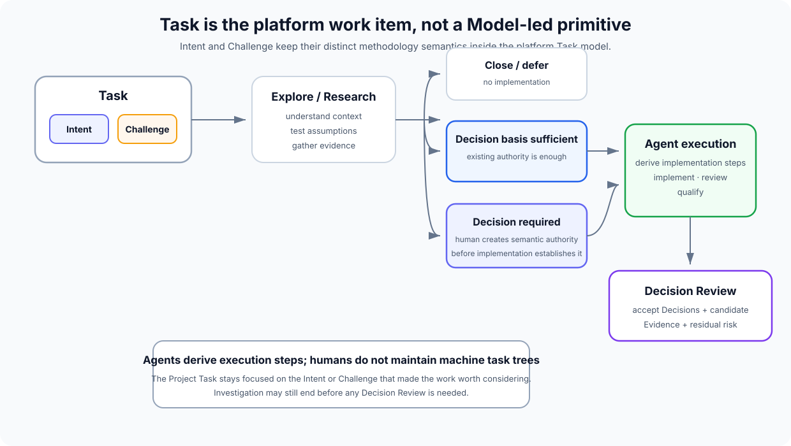

# Potential Git platform: Task model

> **Status:** exploratory implementation concept.  
> **Task is a platform primitive, not a Model-led methodology primitive.**

Model-led defines **Intent** and **Challenge** as separate pre-decisional concepts.

This platform implementation needs a practical human-facing work item, so it groups that potential work under a **Task**.

> **Task is the platform container. Intent and Challenge retain their Model-led semantics.**

The distinction matters: another Model-led implementation could use Jira tickets, Linear issues, documents or conversations instead and never use the word Task.



## Why Task exists in the platform

Traditional Issue objects often mix:

- a problem;
- a desired outcome;
- a proposed solution;
- implementation steps;
- work assignment;
- acceptance criteria.

The platform instead starts by asking what kind of pre-decisional input exists.

A Task is primarily driven by either:

### Intent

> What outcome does a human want to pursue?

Example:

> Reduce resolver latency without reducing correctness.

Intent remains human-owned.

### Challenge

> What deserves to be questioned or investigated?

Example:

> The retry path may violate the idempotency Decision.

Challenges may be raised by humans or agents.

The platform does not collapse the semantics of Intent and Challenge merely because both appear as Tasks.

## Task is potential work

Creating a Task does **not** mean code should be written.

A Task enters the Model-led loop.

It may end after:

- framing;
- exploration;
- research;
- evidence gathering.

For example:

```text
TASK-81
Type: Intent
Reduce API cost by 20%

Research
  current architecture is already close to optimal
  remaining saving requires unacceptable availability trade-off

Outcome
  closed — not pursued

Decisions
  none

Implementation
  none
```

Or:

```text
TASK-91
Type: Challenge
Cache expiry may violate retention policy

Research
  reproduction disproves suspected behaviour

Outcome
  resolved — no change

Decisions
  none

Implementation
  none
```

Investigation is useful even when nothing ships.

## Suggested Task shape

A platform-native Task might contain:

```yaml
id: TASK-142
kind: intent
title: Reduce authentication latency
created_by: human:jralph
state: exploring

intent:
  outcome: >
    Reduce authentication latency without weakening
    current session guarantees.

linked_challenges:
  - TASK-139

decision_basis:
  - DEC-41
  - DEC-67

proposed_decisions: []

areas:
  - authentication

decision_review: null
```

A Challenge-driven Task might instead have:

```yaml
id: TASK-139
kind: challenge
title: Session refresh may issue duplicate tokens
created_by: agent:adversarial-review
state: researching

challenge:
  target:
    decisions:
      - DEC-67
  observation: >
    Concurrent refresh attempts appear capable of producing
    two valid successor tokens.

evidence:
  - EV-991
```

This is illustrative, not a stable schema.

## Human and agent creation authority

### Intent Task

An Intent is human-owned.

An agent may:

- draft an Intent Task;
- suggest one;
- refine wording;
- attach research.

The Task should not become an active human Intent merely because an agent invented an outcome.

### Challenge Task

A Challenge may be created directly by a human or agent.

This is one of the platform's useful machine-initiative paths:

> An agent can create work for human attention without acquiring authority to decide the answer.

## Task lifecycle

A Task can move through the Model-led loop.

Possible conceptual states include:

```text
open
exploring
researching
decision-needed
ready-for-implementation
implementing
reviewing
qualifying
resolved
deferred
closed-no-change
```

These names are not important enough to be methodology concepts.

The important transitions are semantic.

### Explore / Research

Understand the Intent or Challenge and reconstruct enough of the current model.

### No change required

Close or defer.

No Decision Review or implementation is required.

### Existing Decision basis is sufficient

If implementation is useful and accepted Decisions already constrain it adequately, work can proceed without proposing a new Decision.

The Task explains why the work exists. The existing Decision basis explains what semantic authority governs the result.

A Decision Review can then link the Task to that existing Decision basis and accept the resulting implementation/evidence without creating any new Decision.

### New semantic authority is required

The Task has exposed a missing semantic choice.

An agent or human may propose a new or superseding Decision.

Agents may explore and build candidate implementation against the proposal, but the resulting semantics must not become authoritative or releasable until a human accepts the Decision.

### Implementation and qualification

Agents derive execution work, implement against the Decision basis, review conformance and gather Evidence.

### Acceptance

A Decision Review records:

- the originating Task;
- the accepted Decision basis;
- any newly human-accepted Decisions;
- the exact implementation candidate;
- applicable Evidence and residual risk.

The Task can then resolve against that accepted result.

## Why work and authority are separate

A Task and a Decision answer different questions:

> **Task / Intent / Challenge:** why are we spending attention on this?

> **Decision basis:** what accepted semantic authority governs any resulting implementation?

A Task can complete after research with no implementation. If semantic implementation is accepted, it should be traceable to an accepted Decision basis even when no new Decision was created.

## Tasks do not replace Decisions

A completed Task is not durable authority.

For example:

> TASK-142: reduce authentication latency

may disappear from day-to-day attention once complete.

The durable semantic result may be:

> DEC-201: refresh-token validation remains authoritative even when cached session metadata is available.

The Task explains **why work happened**.

The Decision explains **what the Project now authoritatively believes**.

## Tasks do not become implementation plans

Agents can derive execution steps from a Task.

For example:

```text
TASK-142
  Agent Workspace A
    inspect resolver
    benchmark cache
    change API
    update infrastructure
    add qualification fixture
```

Those steps are not first-class Project Tasks merely because an agent needs to perform them.

This keeps the human work model from exploding into thousands of machine-generated subtasks.

The platform can show agent plans when useful without pretending they require human project management.

## Challenge Task may expose an Intent

The two Task kinds can lead into each other.

Example:

```text
Challenge
  regional failover currently takes six minutes

Human conclusion
  this should be improved

Intent
  survive loss of a region without meaningful user interruption
```

The platform has options for representing this:

- create a linked Intent Task;
- attach a human-owned Intent to the existing Challenge Task;
- open a Decision Review that records the new Intent.

The exact UI can be tested.

What must not happen is semantic collapse: the original Challenge and the later human Intent answer different questions and should remain distinguishable in provenance.

## Intent Task may expose Challenges

Similarly:

```text
Intent
  remove dependency on current cloud provider

Research Challenge
  current queue semantics depend on provider-specific ordering guarantees
```

An agent may create the Challenge Task automatically and link it to the originating Intent Task.

The original Intent remains human-owned.

## Task to Decision Review

A Decision Review is not required the moment a Task is created.

It becomes useful once there is something to accept:

- proposed Decisions;
- implementation under an existing Decision basis;
- Evidence;
- accepted residual risk.

Conceptually:

```text
Task
  Intent or Challenge
        |
   Explore / Research
        |
        +---- close / defer
        |
        +---- sufficient accepted Decision basis
        |          |
        |      implementation
        |          |
        +------ Decision Review
        |
        +---- new Decision required
                   |
              proposed Decision
                   |
              candidate implementation
                   |
              human acceptance
                   |
              Decision Review
```

This keeps exploration cheap and prevents every idea from creating branches and agent workloads.

## Tasks replace much of today's Issue model

In the platform UI, **Tasks** can take the place occupied by Issues in today's Git hosts.

Useful filters might include:

```text
Tasks
  All
  Intents
  Challenges
  Needs human decision
  Exploring
  Implementing
  Awaiting review
  Deferred
  Resolved
```

A modern-day Jira/Linear/GitHub work item often maps naturally to one of the two kinds:

| Traditional work item | Platform Task |
| --- | --- |
| Add passkey login | Intent |
| Reduce API latency | Intent |
| Checkout sometimes charges twice | Challenge |
| Investigate memory growth | Challenge |
| Retention may violate new regulation | Challenge |
| Move workloads off provider X | Intent |

Implementation-only machine steps should generally stay below this Project Task layer.

## Project history

Tasks provide useful provenance without becoming authority.

A Project timeline might show:

```text
TASK-139 Challenge raised by review agent
  Session refresh may issue duplicate tokens

TASK-139 Research complete
  Decision gap confirmed

TASK-142 Intent accepted by human
  Prevent duplicate token issuance during concurrent refresh

DR-88 opened
  DEC-P201 proposed

DR-88 accepted
  DEC-201 + API@a921 + web@f189

TASK-139 resolved
TASK-142 achieved
```

The Project now preserves:

- what was questioned;
- what humans wanted;
- what they decided;
- how agents implemented it;
- what Evidence supported acceptance.

## Platform principle

A useful rule for the product is:

> **Tasks explain why work exists. Accepted Decisions explain what authority governs the result. Agents derive execution work from that Decision basis.**

A new Decision is required only when the existing accepted basis cannot authorise the intended semantics.

Task is simply the platform's container that makes that practical.
