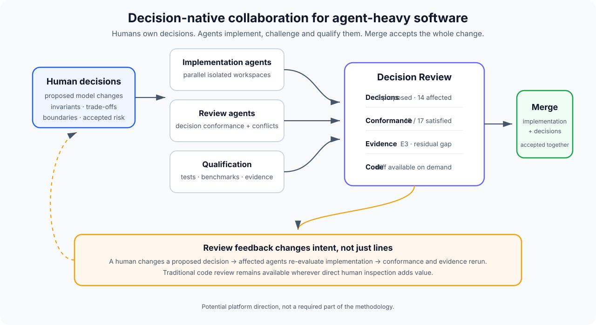

# Potential future Git platform

> **Status:** exploratory future application of the methodology.  
> This is not a required part of model-led agentic engineering and is not an accepted platform design.

Model-led agentic engineering can be practised on top of today's Git and pull-request tooling.

However, the methodology suggests a different collaboration model may eventually be more natural for software produced heavily by agents.

The central idea is simple:

> **Treat decisions as first-class repository objects and treat code as an implementation of those decisions.**

A future Git platform built around this idea would not remove source control, diffs, branches or human review. It would change what the collaboration interface considers most important.

## Why consider a different collaboration primitive?

Traditional pull-request workflows were designed around a world where humans wrote most of the implementation and other humans reviewed the resulting diff.

Agentic engineering changes the throughput balance:

- implementation can be produced much faster;
- several agents can work concurrently;
- changes can become much larger without consuming equivalent human authoring time;
- human reading and judgement throughput has not increased at the same rate.

A pull request containing several thousand generated lines may represent only a handful of meaningful engineering decisions.

The old review surface remains useful, but it may no longer be the best **primary** review surface.

Model-led engineering suggests moving the centre of collaboration towards:

- human decisions;
- semantic changes;
- conflicts between decisions;
- implementation conformance;
- qualification evidence;
- accepted residual risk.

## Decision Review

A future platform could replace or augment the traditional Pull Request with a **Decision Review**.

A Decision Review contains three first-class layers:

### Decisions

What human-authored changes to the system model are being proposed?

Examples:

- a new invariant;
- a changed architectural boundary;
- an accepted performance target;
- a security constraint;
- a product behaviour;
- a decision that supersedes an earlier one.

A review may also contain **no new decisions** when the work is purely implementation-level.

### Implementation

How has the proposed intent been expressed in code, tests, infrastructure, schemas or other artefacts?

The implementation may be produced by:

- one agent;
- several competing agents;
- several collaborating agents;
- a human;
- any combination of the above.

The traditional diff remains available, but it is not necessarily the first thing a human reviewer sees.

### Evidence

What has actually been demonstrated?

Examples:

- deterministic tests;
- integration evidence;
- production-seam tests;
- live dependency checks;
- deployed-path qualification;
- end-to-end user-path evidence.

Residual gaps remain visible rather than being hidden behind a single green check.



## Human review surface

A Decision Review could open with something like:

```text
DR-42  Introduce speculative low-latency resolution

Proposed decisions
  3 new
  1 supersession

Relevant active decisions
  14 loaded
  0 unresolved conflicts

Implementation
  127 files changed
  +6,821 / -1,405
  3 implementation agents contributed

Conformance
  16 / 17 applicable decisions satisfied
  1 material review finding

Qualification
  E1 deterministic behaviour        pass
  E3 production seam                pass
  E4 live dependency                pass
  E6 end-to-end user path           not supplied

Human review
  [ ] accept proposed decisions
  [ ] accept trade-offs
  [ ] accept residual evidence gap
```

The human can still inspect any line of implementation.

The default interaction simply moves towards the questions where human judgement is most valuable.

## Changing a decision during review

Decision-first review becomes particularly useful when a reviewer disagrees with the **intent**, not merely the implementation.

Suppose a proposed decision states:

> Primary user-facing operations must complete within 500 ms.

A reviewer concludes that 500 ms is unnecessarily strict and changes the proposed decision to:

> Primary user-facing operations should complete within 750 ms without reducing accepted correctness.

Because the decision remains mutable until merge, the platform can then:

1. record the changed proposed intent;
2. identify implementation affected by that decision;
3. ask implementation agents to re-evaluate their work;
4. change code where required;
5. rerun conformance review;
6. rerun qualification where the claim changed;
7. return the updated review to the human.

The reviewer changes **the model**, not individual source lines.

Agents propagate that change through implementation.

## First-class decisions

The platform would understand `.decisions/` rather than merely rendering the files as Markdown.

Possible repository views:

### Active decisions

Current human-authoritative decisions after supersession has been resolved.

### History

The immutable chain showing how decisions evolved.

### By type

- invariants;
- architecture;
- behaviour;
- interfaces;
- security;
- operations;
- product;
- process.

### By area or path

Relevant decisions for a subsystem or changed path.

### Provenance

For a decision:

- the Decision Review that proposed it;
- who accepted it;
- the implementation merged with it;
- evidence available at acceptance;
- later decisions that supersede it.

## Semantic conflicts

Traditional Git detects textual conflicts.

Agent-heavy development also creates **semantic conflicts**.

Two branches can merge perfectly at the text level while encoding incompatible assumptions.

For example:

- Agent A implements storage assuming data persists indefinitely.
- Agent B changes another subsystem assuming the same data expires after 30 days.
- The changed files do not overlap.
- Git reports a clean merge.

A decision-aware platform can detect that both changes depend on conflicting decisions about retention.

That allows a new class of conflict:

```text
text conflict       same source cannot be merged automatically
decision conflict   implementations depend on incompatible human intent
conformance conflict implementation violates an active decision
evidence conflict   claimed acceptance is not supported by supplied evidence
```

Not every conflict can be detected automatically. The platform's job is to expose likely semantic disagreement early enough for a human to decide.

## Multi-agent workspaces

A decision-native platform becomes more interesting when several agents can work against the same proposed model concurrently.

A Decision Review could create isolated agent workspaces from one baseline.

For example:

```text
Human model + proposed decisions
            |
            +--> Agent A: implementation approach A
            |
            +--> Agent B: implementation approach B
            |
            +--> Agent C: adversarial reviewer
            |
            +--> Agent D: qualification
```

Candidate implementations can then be compared by:

- decision conformance;
- correctness;
- evidence level;
- performance;
- cost;
- maintainability;
- residual uncertainty.

The human chooses between outcomes rather than manually coordinating every implementation detail.

## Repository knowledge as distinct first-class layers

A future platform should avoid collapsing every kind of repository knowledge into one document system.

A useful separation is:

| Artefact | Primary question |
| --- | --- |
| Code | What does the system currently do? |
| Tests | What behaviour is mechanically enforced? |
| Decisions | Why must important things work this way? |
| Architecture/context | How does the current system fit together? |
| Agent guidance | How should agents operate here now? |
| Evidence | What has actually been demonstrated? |
| Roadmap | What might change next? |

Only decisions are necessarily immutable after acceptance.

Other artefacts may evolve in place because they describe current state rather than historical human authority.

## Trust and verification

A decision-native platform does not require blind trust in agent-generated code.

The model is closer to:

> **Trust agents with execution inside bounded authority, then verify conformance and claims independently.**

Possible review chain:

### Human

Are these the decisions we actually want?

### Implementation agent

Produce software that expresses those decisions.

### Review agent

Does the implementation conform to active and proposed decisions?

### Qualification

Does the resulting system behave as claimed?

### Human

Is the remaining risk acceptable?

This keeps human authority while allowing machines to handle far more exhaustive implementation inspection than humans can reasonably perform line by line.

## What stays from Git?

This proposal does not imply replacing the useful foundations of Git.

Potentially retained:

- commits;
- immutable history;
- branches;
- content-addressed objects;
- diffs;
- merges;
- local clones;
- ordinary command-line workflows.

The innovation is primarily in the **collaboration and semantic layer above Git**.

A first implementation could therefore be a Git-compatible platform rather than a new source-control algorithm.

## What might change?

Potential new primitives:

- Decision Reviews instead of code-first Pull Requests;
- first-class decision objects;
- active-decision resolution;
- semantic conflict detection;
- decision-aware agent context;
- implementation-conformance reports;
- evidence attached to a review;
- concurrent agent workspaces;
- decision-change propagation;
- human approval attached to semantic decisions rather than only a merge button.

## Relationship to existing pull requests

Decision Reviews do not need to reject the PR concept completely.

A migration path could be:

1. ordinary Git repository;
2. `.decisions/` becomes first-class;
3. Pull Request UI gains Decisions, Conformance and Evidence surfaces;
4. the primary review object is renamed or reframed as a Decision Review;
5. implementation diffs remain an attached view.

That would allow adoption without requiring teams to replace their whole development environment at once.

## Possible minimal implementation

A useful vertical slice does not need to rebuild GitHub.

It could demonstrate:

1. create/import a Git repository;
2. parse and display `.decisions/` as first-class objects;
3. open a Decision Review with proposed decisions;
4. fork several isolated agent workspaces;
5. let agents implement concurrently;
6. automatically load relevant active decisions for review;
7. generate implementation-conformance findings;
8. display qualification evidence separately;
9. let a human edit a proposed decision;
10. re-run agent implementation/review against the changed decision;
11. merge the selected implementation and decisions together;
12. make the accepted decisions immutable.

That is enough to test whether the collaboration model is useful.

## External context

This idea aligns with a broader industry question rather than depending on any one vendor.

Cloudflare's October 2026 challenge to build a new Git platform for an agent-heavy world explicitly asks developers to rethink repositories, branches, pull requests, worktrees, code review and merge conflicts when many agents work concurrently.

This proposal is one possible answer:

> **Git stores what changed. A decision-native platform also treats why it changed as a first-class, human-owned object.**

Cloudflare does not endorse this methodology; its challenge is simply a useful example of the same underlying pressure becoming visible.

See:

- [Cloudflare: We want you to build the next Git platform on Cloudflare](https://blog.cloudflare.com/next-git-platform-on-cloudflare/)
- [Cloudflare Git competition](https://www.cloudflare.com/git-competition/)

## Open questions

This is intentionally exploratory.

Questions that would need real implementation and user testing include:

1. How many decisions become too many before review gets noisy?
2. How should semantic scope survive large refactors?
3. How reliably can agents detect decision conflicts rather than merely claim conformance?
4. What evidence is strong enough to reduce human code inspection safely?
5. How should human approval be represented without becoming a ceremonial checkbox?
6. How should teams handle disagreement over a proposed decision?
7. How should decision ownership work when several humans jointly own a subsystem?
8. Can a decision change be propagated automatically without creating excessive implementation churn?
9. How should repositories that do not adopt `.decisions/` interoperate?
10. Which parts belong in Git history and which belong in platform metadata?

Until those questions are tested, this remains a potential application of model-led agentic engineering rather than a prescribed future for source control.
