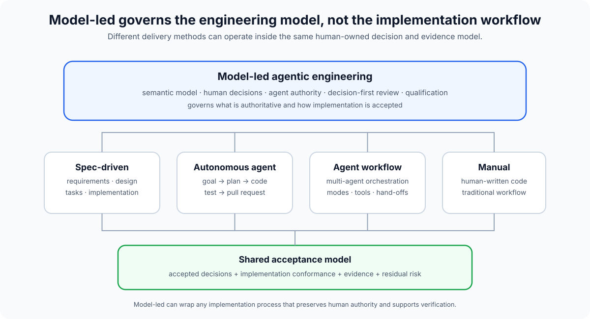

# Model-led vs other AI engineering approaches

Model-led agentic engineering is not another implementation workflow.

It does not require a particular sequence such as requirements → design → tasks → implementation, and it does not prescribe a model, harness, IDE or coding agent.

It is a **governing engineering practice** concerned with:

- who owns the semantic model;
- where accepted engineering decisions live;
- what authority agents have;
- how implementation is checked against human intent;
- how claims are qualified;
- where scarce human review attention is spent.

That means other workflows can run **inside** model-led engineering.

## Spec-driven development

Spec-driven development makes a specification the primary implementation interface.

Examples include:

- [GitHub Spec Kit](https://github.github.com/spec-kit/), which supports structured processes such as Spec → Plan → Tasks → Implement;
- [Kiro Specs](https://kiro.dev/docs/specs/), which produce requirements, design and task artefacts before implementation.

These approaches are compatible with model-led engineering.

A team can use a full spec-driven workflow for a large change, a short intent brief for a smaller one, or no formal specification at all when the semantic risk is low.

The difference is that model-led engineering treats the specification as **one projection of a wider human-owned model**, not as the methodology itself.

A model-led project can therefore be spec-driven without being dependent on spec-driven development.

## Agent workflow and orchestration frameworks

Agent frameworks answer questions such as:

- which agent should do which task?
- should work run sequentially or in parallel?
- how should agents hand work off?
- which tools or permissions should each agent receive?

Model-led engineering uses modes and authority boundaries, but it does not require a specific orchestration system.

Its concern is not primarily how agents coordinate with each other.

Its concern is how **human technical authority remains coherent while agents perform more of the work**.

## Autonomous coding agents

Autonomous agents optimise for outcome ownership by the agent: give the system a task and allow it to plan, implement, test and open a change.

That can be useful inside model-led engineering.

The distinction is authority.

An autonomous implementation agent can have wide execution freedom while still being constrained by:

- accepted decisions;
- invariants;
- trust boundaries;
- qualification requirements;
- human-owned semantic intent.

Model-led engineering is comfortable with high execution autonomy and deliberately conservative about unacknowledged decision authority.

## AI-assisted coding

AI-assisted coding typically increases implementation speed through:

- completion;
- generation;
- debugging;
- explanation;
- local refactoring.

Model-led engineering assumes implementation can be delegated much more aggressively.

The human does not need to remain the primary producer of syntax to remain the engineer responsible for the system.

See [Authorship, ownership and understanding](authorship-and-ownership.md).

## ADRs and architecture records

Architecture Decision Records preserve why significant architectural choices were made.

The model-led decision library overlaps with ADRs but has different intended semantics.

A `.decisions/` library is:

- broader than architecture alone;
- explicitly machine-readable;
- append-only after acceptance;
- designed to be retrieved automatically for agent work;
- able to contain invariants, behaviour, security, interfaces, product and process decisions;
- tied to PR acceptance;
- explicitly human-authoritative even when AI drafts the prose.

ADRs can coexist with the decision library. A project may choose to represent architecture decisions in both systems or use a decision record as its ADR equivalent.

## Steering and repository instructions

Tools such as [Kiro Steering](https://kiro.dev/docs/steering/) and `AGENTS.md` provide persistent instructions to agents.

These are useful implementation context.

They are not the same thing as immutable accepted decisions.

Steering usually describes **what an agent should know or how it should behave now**. It is expected to evolve in place.

A decision library preserves **what humans decided and why**, including the historical path through superseded decisions.

Steering can be generated from or informed by active decisions.

## BMad and similar process methods

[BMad](https://docs.bmad-method.org/) has meaningful philosophical overlap: think before building, use AI for both reasoning and implementation, and keep the human making the calls.

Model-led engineering is narrower in one sense and broader in another.

It is narrower because it does not attempt to package a complete delivery process or set of agent commands.

It is broader because it aims to define a durable ownership, authority, decision and review model that can sit above different delivery processes.

## Decision-first review

This is one of the more important differences.

Traditional pull-request review treats the code diff as the primary human review surface.

That model becomes strained when machine implementation throughput grows much faster than human reading throughput.

Model-led engineering moves the human review centre towards:

- decisions;
- semantic changes;
- trade-offs;
- trust boundaries;
- accepted risk.

Agents can then perform exhaustive implementation-conformance review against both proposed and already accepted decisions.

The implementation is still reviewed. The scarce human attention is simply moved towards the parts where human judgement adds the most value.

See [Decision-first review](decision-review.md).

## Compatibility summary

| Approach | What it primarily governs | Compatible with model-led? |
| --- | --- | --- |
| Manual coding | How implementation is produced | Yes |
| AI-assisted coding | Faster local implementation | Yes |
| Autonomous coding agents | Delegated outcome execution | Yes |
| Spec-driven development | Structured implementation from specs | Yes |
| Kiro Specs | Requirements/design/tasks workflow | Yes |
| GitHub Spec Kit | Structured agentic SDLC processes | Yes |
| BMad | Packaged thinking/building process | Yes |
| ADRs | Historical architecture rationale | Yes |
| Steering / AGENTS.md | Persistent agent guidance | Yes |
| Model-led engineering | Human ownership, decisions, authority, review and evidence | Umbrella practice |

The point is not to replace useful implementation processes.

The point is to provide the **human-governed model they operate inside**.

## Why this matters now

The industry's collaboration model is starting to confront the same problem from another direction.

In October 2026, Cloudflare opened a challenge to build a new Git platform for an agent-heavy world. Their framing explicitly asks developers to rethink repositories, branches, pull requests, worktrees, code review and merge conflicts when large numbers of agents work concurrently.

Cloudflare's proposal does not validate model-led engineering, and this methodology is not based on their work.

It is useful external evidence that the underlying problem is becoming real: **the collaboration and review primitives designed for human-scale code production may not scale unchanged when agents can produce and modify software far faster.**

Model-led engineering's answer is not a new Git host.

Its answer is to move durable human authority into the repository itself, then make decisions and evidence first-class inputs to agent implementation and review.

Sources:

- [Cloudflare: We want you to build the next Git platform on Cloudflare](https://blog.cloudflare.com/next-git-platform-on-cloudflare/)
- [Cloudflare: Build the next GitHub challenge](https://www.cloudflare.com/git-competition/)
