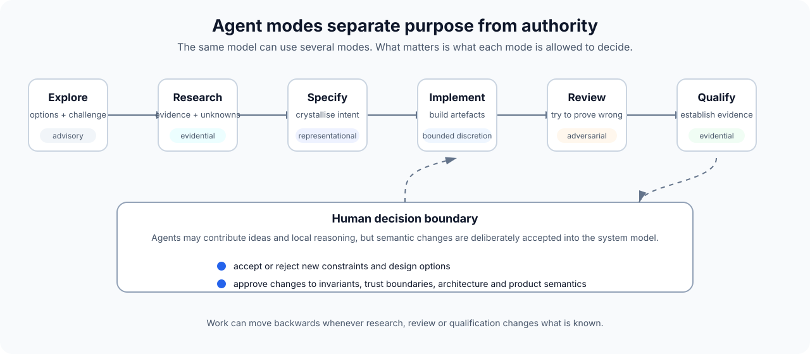

# Agent modes and authority

A mode is a contract for how AI is being used in a piece of work.

It does not require a separate model or a separate agent process. The same model can operate in several modes if the context, authority and expected output are clear.

Separating modes reduces a common failure case: an agent moves from "here is an option" to "I implemented that option" without a deliberate decision in between.

## Explore

**Purpose:** expand the problem space.

Typical work:

- challenge the initial framing;
- generate alternative designs;
- identify edge cases;
- compare trade-offs;
- ask questions the engineer has not considered.

**Authority:** advisory.

Explore mode can be creative. It should not silently commit architecture.

**Output:** options, questions, risks, hypotheses, and Challenges where an unresolved concern should be preserved.

## Research

**Purpose:** reduce uncertainty with evidence.

Typical work:

- inspect existing code;
- read documentation;
- compare technologies;
- trace behaviour;
- benchmark alternatives;
- investigate an unfamiliar domain.

**Authority:** evidential, not decisional.

Research may recommend. It should preserve uncertainty and source boundaries.

**Output:** findings, evidence, limitations, recommendations, and Challenges when research contradicts or weakens the current model.

## Specify

**Purpose:** crystallise accepted intent into a durable implementation contract.

Typical work:

- turn a discussion into an engineering brief;
- record invariants;
- define interfaces and expected behaviours;
- capture non-goals;
- define acceptance and verification conditions.

**Authority:** representational.

Specify mode may represent a human-made Decision or draft an agent-originated proposed semantic Decision.

It must not treat its own proposal, an implementation choice or an unresolved discussion as authoritative without human acceptance.

Missing Decision authority should be surfaced rather than silently filled in to make a document look complete.

**Output:** intent brief, plan, decision record, acceptance criteria.

## Implement

**Purpose:** translate accepted intent into working artefacts.

Typical work:

- source code;
- tests;
- infrastructure;
- schemas;
- migrations;
- documentation tied directly to the change.

**Authority:** bounded local discretion.

Implementation agents should be free to make ordinary coding decisions. They should escalate when a choice changes architecture, security, product semantics, data ownership or another stated invariant.

**Output:** a concrete change plus its local verification. If implementation exposes semantic ambiguity outside local authority, raise a Challenge rather than silently deciding it.

## Review

**Purpose:** try to prove the design or implementation wrong.

Typical work:

- search for model drift;
- inspect failure paths;
- identify missing tests;
- challenge security assumptions;
- compare code against stated intent;
- find accidental scope expansion.

**Authority:** adversarial, not redefinitional.

Review should report issues. It should not quietly move the goalposts or "fix" the requirements.

**Output:** findings with severity, evidence and suggested next action. Material unresolved findings may be preserved as Challenges.

Review mode should retrieve the accepted Decisions relevant to the changed semantic area and explicitly check the implementation for conformance and conflicts.

## Qualify

**Purpose:** establish what the implementation has actually demonstrated.

Typical work:

- deterministic tests;
- integration tests;
- live-provider measurements;
- load tests;
- deployed-path checks;
- end-to-end acceptance;
- cost/latency/accuracy measurements.

**Authority:** evidential.

Qualification must not change thresholds after seeing the result simply to produce a pass.

**Output:** evidence, result, limitations and residual risk. Missing, stale or contradictory evidence may create a Challenge.

## Human decision points

Not every transition needs a ceremonial approval.

The useful checkpoints are where the semantic model might change.

Typical decision points:

- accepting a proposed semantic Decision as authoritative;
- choosing an architecture after exploration;
- accepting a newly discovered constraint;
- changing an invariant;
- widening an agent's authority;
- accepting a trade-off exposed by qualification;
- deciding whether residual risk is acceptable.

## Mode separation is about authority, not bureaucracy

A small task may move through Explore, Implement and Review in one conversation.

A large task may use separate models, sessions and agents for every mode.

The principle is simply that the agent and the engineer both know **what kind of work is currently being done and what decisions that work is allowed to make**.
