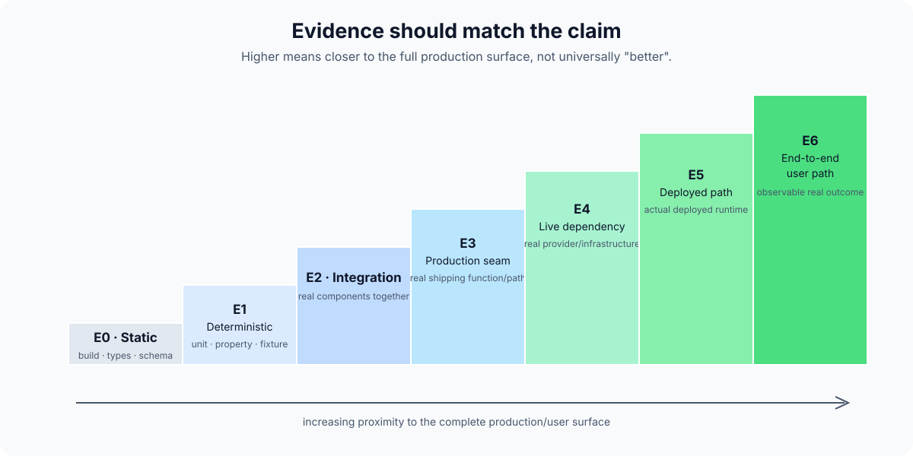

# Verification and evidence

Agent-generated implementation increases the importance of verification, not because AI code is uniquely bad, but because implementation can now be produced faster than a human can manually inspect every line.

The answer is not to replace understanding with more generated tests.

The answer is to make claims explicit and gather evidence that actually supports them.

## Start with the claim

Examples:

- "This function rejects malformed input."
- "The integration handles provider timeouts."
- "The deployed path completes within the agreed latency budget."
- "The new fast path does not increase incorrect executions."
- "The extension cannot access the network without an explicit capability."

Each claim needs different evidence.

## Evidence ladder

This is a useful working classification, not a universal standard.

### E0 — static evidence

Examples:

- type checking;
- linting;
- schema validation;
- compile/build success.

Useful for structural correctness.

Does not prove runtime semantics.

### E1 — deterministic behavioural evidence

Examples:

- unit tests;
- property tests;
- fixed fixtures;
- deterministic policy checks.

Useful for known behaviours and invariants.

Does not prove real external integration behaviour.

### E2 — integration evidence

Multiple real components exercised together under controlled conditions.

Useful for contracts, persistence and component interaction.

### E3 — production-seam evidence

The real production function/path is exercised, even if some dependencies are controlled.

Useful for detecting divergence between a test duplicate and the implementation that actually ships.

### E4 — live dependency evidence

Real external providers or infrastructure are used.

Useful for compatibility, real response shapes, cost and provider behaviour.

Must not automatically be called deployed evidence.

### E5 — deployed-path evidence

The actual deployed service path is exercised.

Useful for routing, configuration, infrastructure and runtime integration.

### E6 — end-to-end user-path evidence

The real client/user path is exercised through to the observable outcome.

This is often the strongest acceptance evidence, but can still have scope limitations.

## Evidence rules

### Do not relabel evidence

A fixture remains a fixture even if it uses production code.

A local call to a real provider is not deployed latency.

A deployed API request is not proof of an installed client flow.

### Preserve failures

Failed cases are part of the result.

Do not silently remove inconvenient cases from the denominator.

### Separate safe failure from incorrect success

In many systems, refusal or uncertainty is safer than confidently doing the wrong thing.

Measure them separately.

### A faster failure is not an improvement

Latency metrics need outcome semantics.

### Finite success is not universal proof

"0 unsafe results in 1,000 cases" is evidence about those 1,000 cases.

It is not evidence that unsafe results are impossible.

### Independent challenge matters

A reviewer or qualifier should not merely reproduce the assumptions of the implementation context.

Independence can come from:

- a fresh agent context;
- a different model;
- a human review;
- deterministic tooling;
- a benchmark defined before implementation.

## Qualification should be designed before the result where practical

For important work, define:

- success conditions;
- failure categories;
- thresholds;
- sample scope;
- evidence class;

before running the final qualification.

This reduces the temptation to move thresholds until the change passes.
